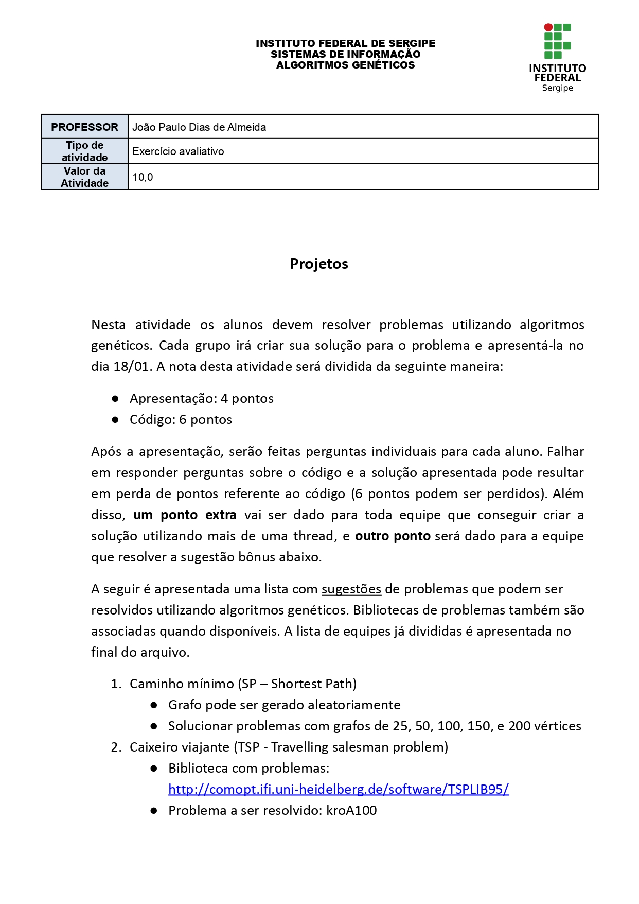
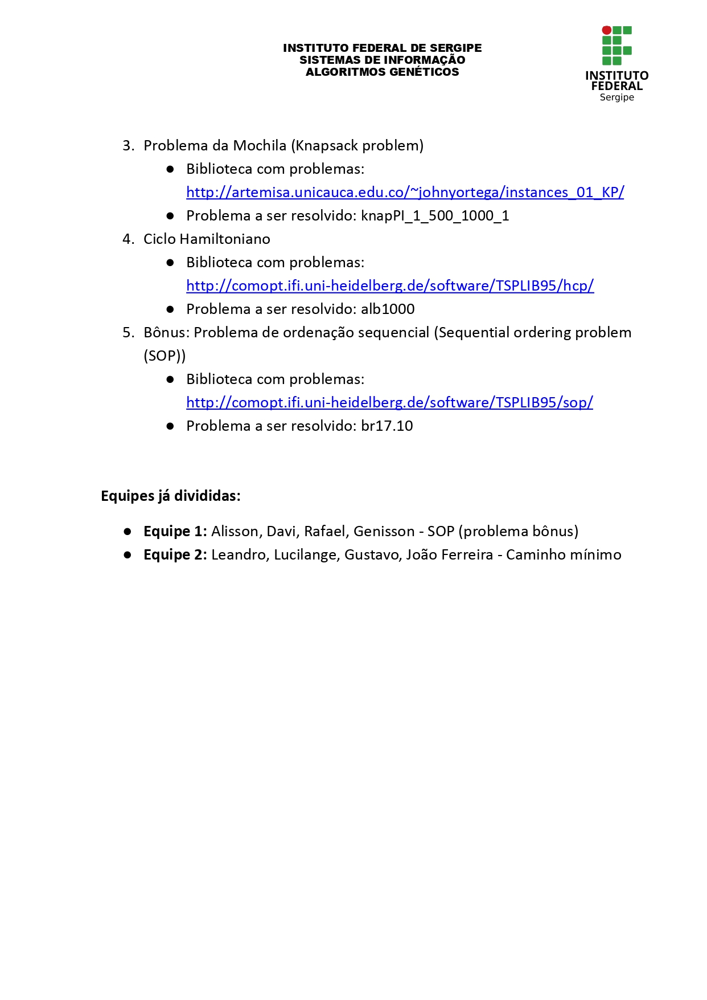

## Desenvolvedores:
- [Alysson Gomes](https://github.com/AlyssonGmes)
- [Davy Leonardo](https://github.com/leodayv)
- [Genisson Santos](https://github.com/Genisson-santos)
- [Rafael Oliveira](https://github.com/raffa43)

Grupo Responsável pelo desafio n° 5 "Sequential ordering problem - (SOP)", 
disponível em:
<http://comopt.ifi.uni-heidelberg.de/software/TSPLIB95/sop/>

Resolvido utilizando algoritmos genéticos

### Projeto:

